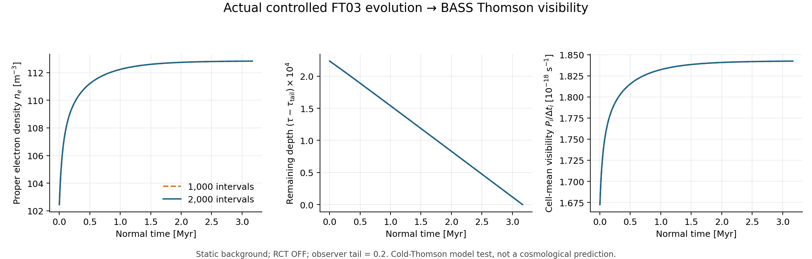

# BASS–REI 실제 상태 연결: BASS-REI-BRIDGE01

2026-10-05 KST. **최신 REI H/He·FT03 상태를 BASS의 전자 밀도, 방향별 Thomson 산란률, 유한 시간 구간 visibility로 연결했다.** 이론 유도와 실제 Rust 구현, 독립 Decimal70 대조, 실제 controlled FT03 시간진화 후처리를 수행했다. 별도 원자물리 재계산은 하지 않았다. 독립 검토는 CONFIRMED, 열린 blocker 0이며 review/FINAL_REVIEW.json에 적용 범위를 고정했다.

## 최신 네 스레드와 이번 결정

| 스레드 | 실제 읽은 commit | 활용과 남은 경계 |
|---|---|---|
| rei_bianchi | 7a15daa38b60a5174315747b9194564dc2d4eb8b | HHe/FT03 상태·proper 전자 밀도 API. RCT 국소 RHS 완료, RCT stepper·expanding consumer·full F04는 미완료 |
| BASS_HE | faea0580e5751ffaf23012f91649c34e48fbb7cb | RCT consumer return 게시됨. HE-F2 owner acceptance와 mixed-native gate는 별도 대기 |
| bass_cr | da8b174267e27f0a70ee7ff12fb130179c1abfab | F04B frozen F03 endpoint의 잔차/root bound. 새 FT03·accepted two-half·연속해로 인증 이월 불가 |
| WU088_HH | 1c1b0971a19a6449bba09d8b8b1febc1ea6162dd | F1D cutoff/saltation 이론. F07 domain/cutoff·consumer 연결은 대기 |

BASS 실제 작업 branch는 `forward/rust-microphysics-host-20260930`, parent는 `14e0cf0486dc834234122f8bd990fe479f593675`, PR132다. main이나 과거 문서의 stale head를 최신 native 코드로 취급하지 않았다. BASS는 REI의 이전 일곱 함수만 연결했으며 dependency가 `1bda1e8…`에 고정되어 있었다. 이번에는 실제 native code commit `41e4592aa494b48929dcd23fc8504c169a98a908`로 연결한다. REC pin은 유지한다.

기존 세 원자 장기 lane과 실패 gate는 그대로다. HE old CURRENT snapshot의 `RCT_INSTANCE_NOT_RECEIVED`와 이후 additive return을 구분했으며, 다른 owner의 완료를 대리 선언하지 않았다. 원자 optional lane의 미완료는 이번 density bridge의 불필요한 대기 조건이 아니다. 상세 source pin·읽은 원문·상태는 survey/에 있다.

## 이론 루프: 정의에서 구현까지

metric은 (−,+,+,+)다. nH,nHe는 같은 물질 정지계의 proper nuclear number density이고 분율 순서는 HII,HeII,HeIII다. 각 원소의 핵수로 정규화하므로

\[
n_e^*=n_H^*x_{\rm HII}+n_{\rm He}^*(x_{\rm HeII}+2x_{\rm HeIII}),\qquad n_{e,\mathrm{SI}}=10^6 n_{e,\mathrm{cgs}}.
\]

이는 filling factor Q, photon number density 또는 comoving nuclear density와 다르다. RCT HeIII+HI→HeII+HII+γ는 직접 자유전자 source가 0이므로 RCT 사건률을 n_e 또는 Thomson rate에 더하지 않는다.

BASS의 기존 MaterialFrame과 ElectronState를 재사용하여 future-directed 정상 관측자 ray clock에 대해

\[
D=\gamma(1-\boldsymbol\beta\cdot\boldsymbol e),\qquad
q_n=c\sigma_T n_e^*D\quad[\mathrm{s}^{-1}]
\]

를 얻는다. c=299792458 m/s와 σT=6.6524587e−29 m²는 기존 BASS constants다. D는 기존 rate 함수에서 **한 번** 적용한다. 물질 proper-time source 변환의 1/γ와 혼용하지 않는다. Density adapter는 source의 임의 c 상수를 opacity로 재사용하지 않으며, 실제 history fixture에서 두 c 값의 일치 여부를 따로 확인했다.

β→0이면 qn=cσTne가 된다. FLRW에서 dt=a dηs이면 qηs=a qn이며, conformal length χ=cηs를 쓰면 qχ=aσTne다. 이 시간좌표 구분을 유도하고 CAMB 공식 symbolic 정의와 대조했다. **이번 native API는 normal-time seconds만 받는다.** 팽창 geometry나 conformal-time adapter를 새로 구현했다고 주장하지 않는다.

Caller가 준 증가하는 시간 경계와 비음수 piecewise-constant rate에 대해

\[
\tau_i=\tau_{\rm tail}+\sum_{j=i}^{N-1}q_j\Delta t_j,
\quad S_i=e^{-\tau_i},
\quad P_i=S_{i+1}\left[-\operatorname{expm1}(-q_i\Delta t_i)\right].
\]

따라서 ΣPi+S0=exp(−τtail)이다. 유한 구간의 probability를 1로 임의 재정규화하지 않고 observer tail을 보존한다. 얇은 구간에서도 차분 cancellation을 피하는 기존 expm1 경로를 쓴다. 두 같은 clock/grid opacity의 L1 차이 E는 survival 차이를 1−exp(−E)로 제한하지만 visibility peak 위치나 연속 chemistry 해의 오차를 자동 인증하지 않는다.

직접 유도, 가정, 차원 검사, Q와 x의 반례, FLRW 극한, quadrature/chemistry 오차 분리는 theory/DERIVATION_KO.md와 CONTRACT.json에 있다. 문헌 대조는 https://camb.readthedocs.io/en/stable/_modules/camb/symbolic.html 및 SOURCE_LEDGER.json의 읽은 범위에 한정된다. CAMB 실행 비교는 수행하지 않았다.

## 코딩 루프와 검증

실제 BASS에 `microphysics/rei_visibility.rs`를 추가했다. `electron_state_from_hhe`, `electron_state_from_ft03`, `ReiOpacityCell`, `integrate_rei_visibility`가 공개 경계다. Source의 공개 `HHeModel::electron_density`가 model/state 유효성을 검사한 뒤 proper nuclear density를 SI로 변환하고 기존 BASS 전자식·ray rate·visibility 적분을 호출한다. 자동 a^-3, Q, 추가 D는 넣지 않는다.

FT03 adapter는 **density-only**다. `Ft03Model.gas`에서 전자 밀도의 정의를 검증할 뿐 온도 의존 chemistry RHS의 domain을 인증하지 않는다. 따라서 opacity에 불필요한 atomic rate 평가를 요구하지 않는다. 실제 진화 이력에는 별도로 `ft03_adaptive_step`를 사용하므로 기존 [30000,110000] K guard와 strict local-error gate가 작동한다. 이 구조는 이전 RCT에서 문제가 되었던 `hhe_rhs(&ft03.gas)` 대체와 다르며, 이번 bridge는 chemistry RHS 자체를 만들지 않는다.

| 검증 | 실제 결과 |
|---|---|
| Missing-API RED | 구현 전 실제 unresolved import 발생, 원 로그 보존 |
| 실제 host module scoped Rust | 20 PASS: 새 bridge 10 + API 1 + 기존 visibility 6 + legacy REI/identity 3 |
| 독립 Decimal70 snapshot | 786 checks PASS, 실제 native 140회: valid 128·invalid 12 |
| 실제 FT03→BASS history | 2회, 1000·2000 구간, 독립 22029 checks PASS |
| 단위·ray rate 최대 scaled 오차 | 2.0e−16 이하, 사전 기준 2e−12 |
| History backward τ 최대 scaled 오차 | 1.994e−15, 기준 2e−12 |
| Probability mass balance 최대 절대 오차 | 2.605e−16, 기준 2e−14 |

부정 대조는 10^6 누락, D 두 번 적용, photon clock 대신 atomic 1/γ 사용, HeIII 전하계수 1 사용을 검출했다. 음수/비유한 입력, 잘못된 방향, 단위변환 overflow를 거절하며 중성상태에서도 방향을 검사한다. 전체 핵밀도 0은 원 REI validator가 거절한다.

정확한 source modules와 전체 현재 REI dependency를 offline scoped harness로 컴파일했다. **전체 BASS crate build는 실행하지 않았다.** 기존 전체 dependency graph와 REC 등을 포함한 build 결과로 20개를 표시하지 않는다. Rust 1.94.1을 사용했고 source·binary·oracle SHA는 evidence/FINAL_INTEGRATION.json에 있다. 원 일곱 REI 함수 구현은 byte-identical이고 새 dependency의 추가 모듈은 별도다. 기존 pin을 지키는 manifest/lock/test/checker의 네 위치를 함께 갱신했다. 과거 dependency receipt는 보존하고 새 SUCCESSOR_DEPENDENCY_LOCK.json에서 계승 관계를 표시한다.

## 실제 downstream 곡선

Controlled FT03 초기 상태, static geometry H=0, RCT OFF, t∈[0,10^14] s, observer tail=0.2, left-endpoint opacity sampling을 사용했다. Fine 2000구간 결과는

- ne: 102.45 → 112.83224926834306 m⁻³
- T: 50000 → 46683.5541528309 K
- 구간에서 누적된 Thomson optical depth: 2.2336042110622e−4
- 관측 구간 probability mass: 1.8285162411208654e−4

이다. Native의 accepted two-half 상태를 이어받았고 실패를 감추는 timestep retry를 추가하지 않았다. 최대 step local error는 2.131e−5, residual은 9.933e−15였다.

1000/2000 이력의 공통 세분 grid에서 opacity L1 차이는 8.00733381490822e−9, survival 최대 차이는 6.5168602e−9로 대응하는 map bound 안에 있었다. 이는 **두 실제 이산 이력의 유한 차이**이며 수렴차수 측정이나 continuum error certificate가 아니다. CR의 frozen F03 bound도 이 결과로 승격하지 않는다.

그림·PDF와 원 JSON/CSV를 제공한다. 이 곡선은 실제 연결 코드의 계산 결과이며 관측 가능한 reionization history 또는 새로운 물리 예측은 아니다. 기존 cold-Thomson 근사를 고정한 수치 연결 시험이다. 유한 온도 tail·Klein–Nishina·polarized kernel의 오차 인증은 unresolved이고 BASS의 `UNVERIFIED_FINITE_TEMPERATURE_TAIL`, `SCALAR_Q_KERNEL_UNRESOLVED`를 해제하지 않는다.

## 다음 실행과 인계

publication/LOW_COST_ENTRY.json부터 읽고 NEXT_HANDOFF_KO.md와 RESEARCH_DAG.json을 따른다. 가장 가까운 과학 단계는 REI가 실제 accepted expanding state/normal-time/density/frame payload를 제공하는 EXP01이다. 이를 기존 bridge에 넣어 FLRW τ·visibility를 비교한 뒤 Bianchi ray/background 연결로 나아간다. Spectral/temperature domain, scalar-Q collision generator, RCT stepper는 각각 별도의 명시된 gate다.

게시 대상은 기존 BASS native branch/PR132이며 main merge는 수행하지 않는다. REI용 consumer-return은 비공개 BASS 패킷 안에 준비한다. 공개 rei_bianchi에는 비공개 BASS source·문서를 복제하지 않는다. Git code/packet commit은 publication/GITHUB_PUBLICATION_RECEIPT.json, Drive/Dropbox 완료 응답·크기 대조는 BACKUP_RECEIPT.json에 기록한다. Upload verification과 full archive restore는 구분한다. 새 백업을 되돌릴 때는 이번 BASS_REI_BRIDGE01_20261005_v1 폴더만 대상으로 하고 이전 산출물을 보존한다.
